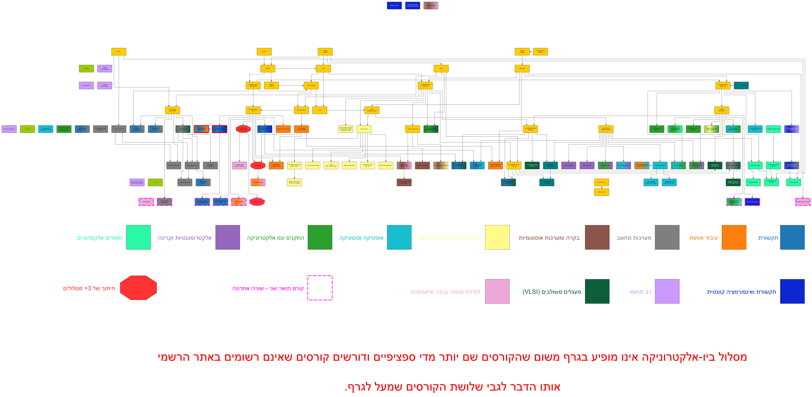
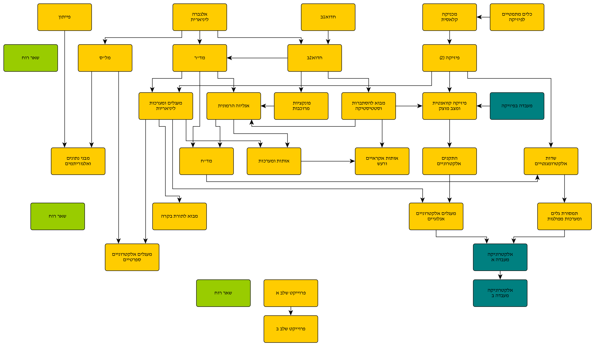
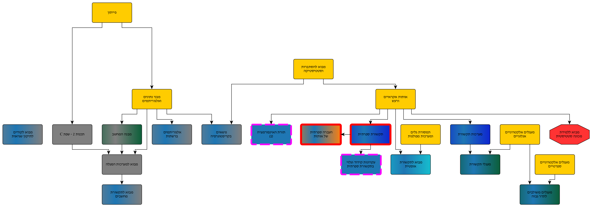
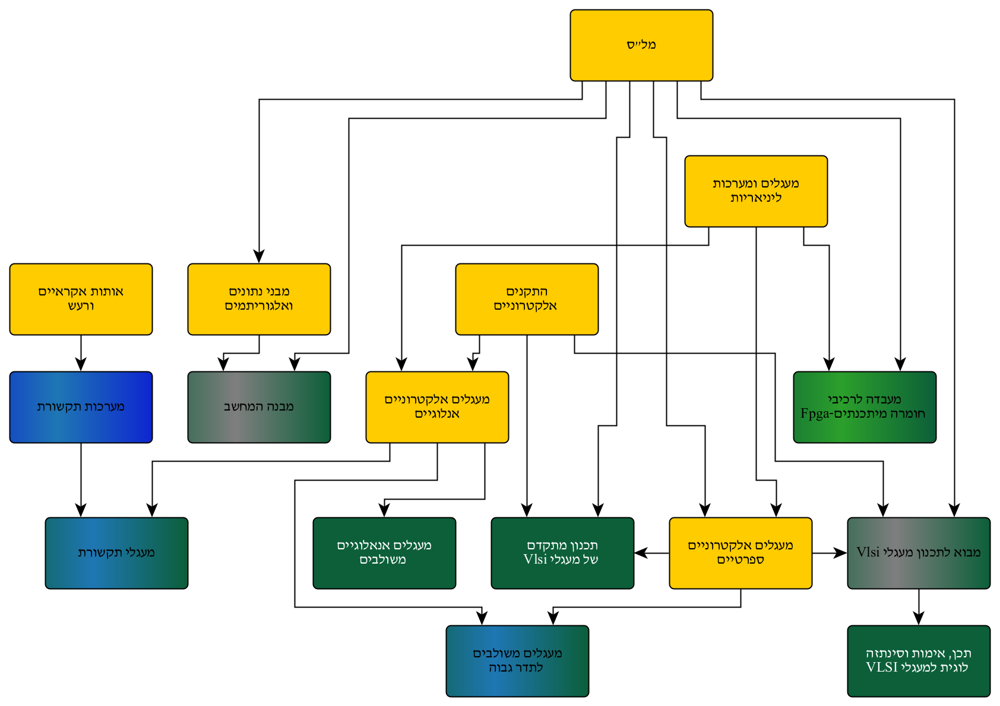
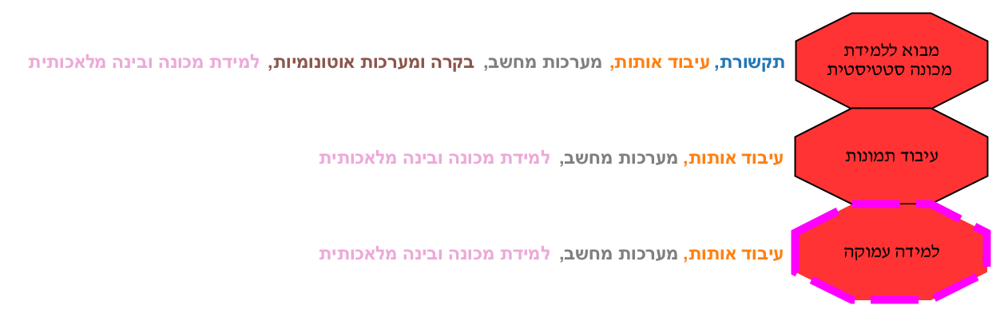
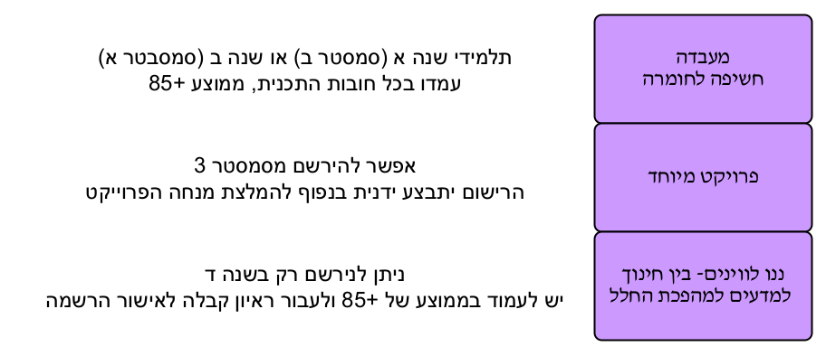

# Electrical Engineering courses at TAU (2026)
Diagrams of the courses you can take at TAU while doing B.Sc in EE.  

All the diagrams are made top-to-bottom - meaning that the first row is the first semester, second is the second and so on.  
Starting from 5th semester you may choose electives. All of the elective classes are in the first row of the semester they can be taken.  
Example: you can take Computer Architecture starting from the 6th semester (given you have completed the prerequisites), but that doesn't mean you aren't allowed to take it in your last one.  

Note that the diagrams only represent a regular 4-year engineering program. You can extend that period and/or retake some classes - in which case your plan will be slightly shifted.  

---

## 📍 Quick Navigation
* [🗺️ Overview](#overview)
* [🏛️ Foundations](#foundations)
* [🛤️ Academic Tracks](#tracks)
* [🎓 Special](#special)

> [!IMPORTANT]
> ### 🔍 Viewing Quality & Interaction
> Due to the large scale of these maps, the **previews** shown below appear blurry and are difficult to read.
> * **[Open the SVG]** or **[Download the Source]** links provided under each section (to use GRAPHML files you need to install [yEd Graph Editor](https://www.yworks.com/products/yed))
> * SVG files can be opened in the browser and each node contains a hyperlink, leading to the university's website with the schedule for that course (second semester, 2026)
---

<h2 id="overview">🗺️ Overview</h2>

The complete map of all the mandatory courses as well as the electives you are allowed to take.  
The diagram omits Bioelectronics track as all courses there (except the Intro to Lasers) aren't listed as the courses you can usually take. These courses are mostly offered in Biomedical Engineering.  
3 courses that can be seen above the diagram are the courses that are in the same position as the Bioelectronics track.

> 🔍 **[Open SVG](./Main/Everything/main.svg)** | 🛠️ **[Download yEd Source](./Main/Everything/main.graphml)**

---

<h2 id="foundations">🏛️ Foundations</h2>

The foundational mandatory courses that must be taken by every student enrolled into EE at TAU as of 2026.

### Mandatory Courses

> 🔍 **[Open SVG](./Main/Mandatory/Mandatory.svg)** | 🛠️ **[Download yEd Source](./Main/Mandatory/Mandatory.graphml)**

---

<h2 id="tracks">🛤️ Academic Tracks (12)</h2>

These diagrams show the specific courses for each track and how they connect back to the **Mandatory** core.

  
<b>▶ Track 01 - 📡 Communications</b>

   

  

  > 🔍 **[Open SVG](./Main/Tracks/Communications/Communications.svg)** | 🛠️ **[Download yEd Source](./Main/Tracks/Communications/Communications.graphml)**

  
<b>▶ Track 02 - 📉 Signal Processing</b>

   

  

  > 🔍 **[Open SVG](./Main/Tracks/Signal%20Processing/Signal%20Processing.svg)** | 🛠️ **[Download yEd Source](./Main/Tracks/Signal%20Processing/Signal%20Processing.graphml)**

  
<b>▶ Track 03 - 💻 Computer Systems</b>

   

  

  > 🔍 **[Open SVG](./Main/Tracks/Computer%20Systems/Computer%20Systems.svg)** | 🛠️ **[Download yEd Source](./Main/Tracks/Computer%20Systems/Computer%20Systems.graphml)**

  
<b>▶ Track 04 - 🕹️ Control Systems</b>

   

  

  > 🔍 **[Open SVG](./Main/Tracks/Control/Control%20%26%20Autonomy.svg)** | 🛠️ **[Download yEd Source](./Main/Tracks/Control/Control%20%26%20Autonomy.graphml)**

  
<b>▶ Track 05 - 🔋 Energy & Renewables</b>

   

  

  > 🔍 **[Open SVG](./Main/Tracks/Energy%20%26%20Renewables/Energy%20%26%20Renewables.svg)** | 🛠️ **[Download yEd Source](./Main/Tracks/Energy%20%26%20Renewables/Energy%20%26%20Renewables.graphml)**

  
<b>▶ Track 06 - 🔦 Optics & Photonics</b>

   

  

  > 🔍 **[Open SVG](./Main/Tracks/Optics%20%26%20Photonics/Optics%20%26%20Photonics.svg)** | 🛠️ **[Download yEd Source](./Main/Tracks/Optics%20%26%20Photonics/Optics%20%26%20Photonics.graphml)**

  
<b>▶ Track 07 - 🔬 Devices & Nanoelectronics</b>

   

  

  > 🔍 **[Open SVG](./Main/Tracks/Devices%20%26%20Nanoelectronics/Devices%20%26%20Nanoelectronics.svg)** | 🛠️ **[Download yEd Source](./Main/Tracks/Devices%20%26%20Nanoelectronics/Devices%20%26%20Nanoelectronics.graphml)**

  
<b>▶ Track 08 - 🧲 EM & Radiation</b>

   

  

  > 🔍 **[Open SVG](./Main/Tracks/EM%20%26%20Radiation/EM%20%26%20Radiation.svg)** | 🛠️ **[Download yEd Source](./Main/Tracks/EM%20%26%20Radiation/EM%20%26%20Radiation.graphml)**

  
<b>▶ Track 09 - 🧪 Electronic Materials</b>

   

  

  > 🔍 **[Open SVG](./Main/Tracks/Electronic%20Materials/Electronic%20Materials.svg)** | 🛠️ **[Download yEd Source](./Main/Tracks/Electronic%20Materials/Electronic%20Materials.graphml)**

  
<b>▶ Track 10 - ⚛️ Quantum Communications and Information</b>

   

  

  > 🔍 **[Open SVG](./Main/Tracks/Quantum%20Comms%20%26%20Info/Quantum%20Comms%20%26%20Info.svg)** | 🛠️ **[Download yEd Source](./Main/Tracks/Quantum%20Comms%20%26%20Info/Quantum%20Comms%20%26%20Info.graphml)**

  
<b>▶ Track 11 - 📟 VLSI</b>

   

  

  > 🔍 **[Open SVG](./Main/Tracks/VLSI/VLSI.svg)** | 🛠️ **[Download yEd Source](./Main/Tracks/VLSI/VLSI.graphml)**

  
<b>▶ Track 12 - 🤖 AI/ML</b>

   

  

  > 🔍 **[Open SVG](./Main/Tracks/AI%20%26%20ML/AI%20%26%20ML.svg)** | 🛠️ **[Download yEd Source](./Main/Tracks/AI%20%26%20ML/AI%20%26%20ML.graphml)**

---

<h2 id="special">🎓 Special Courses</h2>

Given that there are so many tracks, there bound to be courses that are considered to be in several tracks at once.  
In the [🗺️ Overview](#overview), I used red octagons to represent courses that are in 3 or more tracks at the same time. Here you can see exactly which tracks they belong to:

 

> 🔍 **[Open SVG](./Main/Special/Central.svg)** | 🛠️ **[Download yEd Source](./Main/Special/Central.graphml)**

 

In addition, you might've also noticed certain **purple-colored** courses—those are from a track I decided not to list fully as it has almost no connections to other courses.  
The track is called **Multidisciplinary**, and 3/5 courses in it require a high average, an interview, or have limited availability:

 

> 🔍 **[Open SVG](./Main/Special/special.svg)** | 🛠️ **[Download yEd Source](./Main/Special/special.graphml)**

 

There are other "special courses"—those usually given to Master's students but allowed for Bachelor's students with professor approval.  
All these courses can be found in the last row of the [🗺️ Overview](#overview) and have a **magenta dotted line** as their border.
